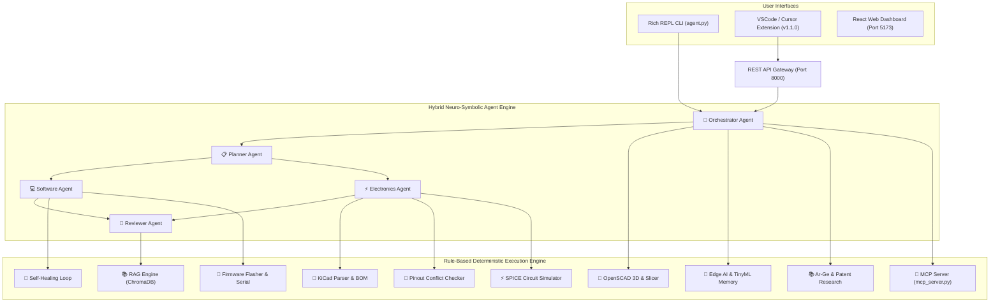

# 🤖 Autonomous Agent System — SOTA Multidisciplinary Engineering OS

> **v2.5 High-Efficiency Release**  
> A State-of-the-Art Autonomous Engineering & R&D Workstation combining **Neuro-Symbolic AI**, **Multi-Agent DAG Orchestration**, **KiCad PCB Tools**, **Self-Healing Build Loops**, **Firmware Flashing**, **Mechanical CAD**, **Edge AI / TinyML**, and a standard **Model Context Protocol (MCP) Server**.

---

## 🏗️ System Architecture



---

## 📁 Repository Directory Structure

```
agent_system/
├── agent.py                       # Main REPL CLI with Rich UI, Badges & Slash Commands
├── mcp_server.py                  # Standard MCP Stdio JSON-RPC 2.0 Server
├── core/
│   ├── agent_test.py              # Agent Unit Testing & Quality Assurance
│   ├── cache.py                   # Semantic Cache Engine (%80 Token Savings)
│   ├── cli_ui.py                  # Rich Terminal Engine (Badges, Thinking Box, TUI)
│   ├── component_search.py        # Mouser/DigiKey/LCSC Component API Integration
│   ├── consensus.py              # Multi-Model Consensus Voting (OpenAI+Claude+Gemini)
│   ├── datasheet.py              # Datasheet PDF Extractor (Pin Tables, Electrical Specs)
│   ├── datasheet_compare.py      # Comparative Datasheet Specification Matrix
│   ├── edge_ai.py                 # TinyML Peak Memory Estimator & ESP-DL C++ Wrapper
│   ├── executor.py               # Tool Executor (gcc, g++, make, platformio)
│   ├── flasher.py                # USB Firmware Flasher (esptool/st-flash) & Serial Monitor
│   ├── git_ops.py                # Automated Git Version Control
│   ├── github_pr.py              # GitHub Branch & Pull Request Automation
│   ├── llm.py                    # Multi-Provider Router (OpenAI, Anthropic, Gemini, Ollama)
│   ├── longmem.py                # SQLite Persistent Long-Term Memory
│   ├── mechanical.py             # OpenSCAD 3D Parametric CAD & Slicer Recommendations
│   ├── mcp_client.py             # MCP Execution Mode Switcher (/mcp-mode)
│   ├── notify.py                 # Webhook System (Slack, Discord, Telegram)
│   ├── pinout.py                 # Pinout Conflict Checker (ESP32/STM32/RP2040)
│   ├── pipeline.py               # Multi-Agent DAG Orchestration Engine
│   ├── plugins.py                # Dynamic Plugin Architecture
│   ├── profile.py                # Personalized Engineer Profile Manager
│   ├── project_gen.py            # Multidisciplinary Project Repository Generator
│   ├── rag.py                    # RAG Vector Store Engine (ChromaDB + pdfplumber)
│   ├── research.py               # arXiv Academic Search & Patent Prior Art Generator
│   ├── runner.py                 # Sub-Agent Prompt Router & Context Loader
│   ├── schematics.py             # KiCad S-Expression Parser & CSV BOM Analyzer
│   ├── self_heal.py              # Autonomous Self-Healing Compilation Repair Loop
│   ├── self_improve.py           # Auto-Refine Agent Prompt Specs
│   ├── service.py                # Daemon Service Manager (FastAPI + Vite)
│   ├── spice.py                  # SPICE RC/RLC Circuit Simulator Engine
│   ├── tui_dashboard.py          # Interactive Terminal TUI Dashboard Component
│   └── vision.py                 # Base64 Image Encoder for Vision LLMs
├── agents/                       # Sub-Agent Prompt Specifications
│   ├── electronics.md
│   ├── orchestrator.md
│   ├── planner.md
│   ├── reviewer.md
│   ├── software.md
│   └── tutor.md
├── vscode_extension/             # VSCode & Cursor Extension (v1.1.0)
│   ├── package.json              # Extension Manifest & Keybindings (Cmd+Alt+A)
│   ├── src/extension.ts          # Extension Entrypoint & Webview Sidebar Provider
│   └── agent-system-vscode-1.1.0.vsix # Compiled Production VSIX Package
└── subagent_tracker/            # Real-Time Token & Cost Tracer
    ├── backend/main.py           # FastAPI Backend & REST API Gateway
    └── frontend/                 # React Web Analytics Dashboard
```

---

## ⚡ Slash Command Reference (35+ Tools)

| Category | Command | Description |
| :--- | :--- | :--- |
| **Electronics & PCB** | `/kicad <file.kicad_sch>` | Parse KiCad schematic components & net labels |
| | `/kicad-set <file> <ref> <val>` | Update component value directly in `.kicad_sch` file |
| | `/bom <file.csv>` | Parse PCB Bill of Materials CSV line items |
| | `/vision <image_path>` | Encode schematic diagram to Base64 for Vision LLMs |
| | `/datasheet <pdf_path>` | Extract datasheet PDF pin tables, electrical specs & sections |
| | `/part <part_number>` | Search Mouser/DigiKey/LCSC for stock, pricing & datasheet |
| | `/alt <part_number>` | Find in-stock & drop-in alternative components |
| | `/compare <p1> <p2>` | Side-by-side parametric component comparison |
| | `/pinout <sda> <scl> <out>` | Audit GPIO pin collisions & ESP32 strapping hazards |
| | `/spice <r_ohms> <c_farads>` | Simulate RC circuit frequency response & step voltage |
| **Firmware & Production** | `/heal <file.c>` | Autonomous self-healing compilation error recovery loop |
| | `/flash <file.bin>` | Flash firmware binary to MCU via USB/TTY (`esptool`/`st-flash`) |
| | `/serial [port]` | Read live UART serial console logs (`/dev/ttyUSB0`) |
| | `/gerber <folder>` | Analyze PCB Gerber layers & 3D enclosure bounds |
| | `/datasheet-compare <p1> <p2>`| Comparative specification matrix for 2 PDF datasheets |
| **Mechanical CAD & R&D** | `/cad <l> <w> <h>` | Generate OpenSCAD 3D parametric enclosure script |
| | `/slicer <material>` | Recommend 3D printing slicer settings (PLA/ABS/PETG/TPU) |
| | `/arxiv <query>` | Search arXiv scientific preprints for R&D literature |
| | `/patent <invention>` | Generate patent prior art search queries & CPC codes |
| **Edge AI & Personalization**| `/edge-ai <params>` | Estimate TinyML peak SRAM/Flash & MCU suitability |
| | `/profile` | View personalized engineer profile preferences |
| | `/create-project <name>` | Generate unified project workspace (firmware+hw+cad+ai) |
| **Execution & Pipeline** | `/pipeline <task>` | Run DAG workflow (Planner → [Hardware + Software] → Reviewer) |
| | `/consensus <prompt>` | Run parallel consensus voting across OpenAI, Claude & Gemini |
| | `/run <command>` | Execute shell build command (`gcc`, `make`, `platformio`) |
| | `/git-commit <msg>` | Auto stage & commit all workspace changes |
| | `/pr <branch> <title>` | Create git branch, commit & submit GitHub Pull Request |
| | `/test` | Run automated agent unit test suite |
| | `/mcp-mode [on\|off]` | Toggle between Direct Native Execution & MCP Stdio Protocol |
| | `/mcp` | Display Model Context Protocol (MCP) server guide |
| | `/tui` | Display interactive TUI system status dashboard |

---

## 🔌 Model Context Protocol (MCP) Server Integration

To connect this entire multidisciplinary system directly into **Claude Desktop**, **Cursor**, or **Antigravity**, add to `claude_desktop_config.json`:

```json
{
  "mcpServers": {
    "agent-system": {
      "command": "python3",
      "args": ["/Users/alihanesentas/Desktop/agent_system/mcp_server.py"]
    }
  }
}
```

---

## 💻 VSCode & Cursor Extension Installation

The repository includes a compiled production package: **`vscode_extension/agent-system-vscode-1.1.0.vsix`**.

### Installation Command:
```bash
code --install-extension vscode_extension/agent-system-vscode-1.1.0.vsix --force
```

### Features:
- **Left Activity Bar Icon (`🤖 Agent System`)**: Opens interactive Webview Sidebar Panel.
- **`Cmd+Alt+A` / `Ctrl+Alt+A`**: Runs sub-agent task on highlighted code block.
- **MCP Mode Toggle Switch**: Switch between Direct Native Mode (0% token overhead) and MCP Protocol Mode.
