# 🚀 Neuro-Symbolic Multi-Agent Engineering & Autonomous System

[](https://opensource.org/licenses/MIT)
[](https://www.python.org/)
[](https://marketplace.visualstudio.com/)
[](https://modelcontextprotocol.io/)
[](#-5-katmanlı-sistem-mimarisi)

---

## 📌 Proje Özeti

**Neuro-Symbolic Multi-Agent System**, gömülü sistemler (Embedded Systems), PCB elektronik tasarımı (KiCad), 3D mekanik CAD çizimi (OpenSCAD), Edge AI / TinyML ve Ar-Ge araştırmaları için özel olarak geliştirilmiş **tam otonom, katmanlı bir mühendislik işletim sistemidir**.

Yapay zeka modellerinin (Claude 3.5 Sonnet, GPT-4o, Gemini 1.5 Flash) muhakeme yeteneğini, yerel bilgisayarınızda çalışan **0-Token ($0 Maliyetli) Sembolik Python İşlem Motorları** ile birleştirerek **%80-90 token maliyet tasarrufu** ve **%100 matematiksel kesinlik** sağlar.

---

## 🏛️ 5-Katmanlı Sistem Mimarisi (5-Layer Architecture)

Sistem, sorumlulukların ayrılması (Separation of Concerns) ilkesine uygun olarak 5 bağımsız katmandan oluşur:

```mermaid
graph TD
    subgraph Layer1["Layer 1: Presentation & Interfaces"]
        CLI["Rich REPL CLI (agent.py)"]
        VSC["VSCode / Cursor Extension v1.2.0"]
        WEB["React Web Analytics Dashboard"]
        MCP["MCP Server (JSON-RPC 2.0)"]
    end

    subgraph Layer2["Layer 2: Orchestration & Strategy"]
        ORCH["Claude 3.5 Sonnet / GPT-4o Orchestrator"]
        AUTO["/auto True Goal-Driven Loop"]
        TREE["/tree Live Agent Tree Monitor"]
    end

    subgraph Layer3["Layer 3: Domain Specialist Sub-Agents"]
        HW_AGENT["Electronics PCB Agent (GPT-4o-mini)"]
        SW_AGENT["Firmware C++ Agent (Gemini Flash)"]
        CAD_AGENT["Mechanical 3D CAD Agent"]
        REV_AGENT["Reviewer & EMC Compliance Agent"]
    end

    subgraph Layer4["Layer 4: Deterministic 0-Token Python Engines"]
        SPICE["SPICE RC Filter Simulator"]
        PINOUT["ESP32 Pinout Conflict Auditor"]
        THERMAL["Thermal Dissipation Calculator"]
        DRC["PCB DRC & 50Ω Trace Impedance"]
        CAD["OpenSCAD 3D Enclosure Generator"]
        FLASHER["USB Firmware Flasher & Serial"]
    end

    subgraph Layer5["Layer 5: Persistence & Infrastructure"]
        RAG["ChromaDB Vector Store RAG"]
        MEM["SQLite Long-Term Memory"]
        PROFILE["User Engineering Profile"]
        QUEUE["Async Worker Queue & Token Bucket"]
    end

    Layer1 --> Layer2
    Layer2 --> Layer3
    Layer3 --> Layer4
    Layer4 --> Layer5
```



---

## 📁 Modüler Sub-Package Dizin Yapısı (`core/`)

Kod tabanı, yüksek bakımı yapılabilirlik ve temiz mimari için 5 ana alt pakete ayrılmıştır:

```
core/
├── __init__.py                  # %100 Geriye dönük uyumlu re-export girişi
├── engine/                      # 🤖 İş Akışı, DAG & Otonom Simülasyon Motorları
│   ├── agent_tree_sim.py        # /tree Canlı Ağaç Hiyerarşi Simülasyonu
│   ├── arena.py                 # /arena Model Karşılaştırma Testi
│   ├── autonomous_agent.py      # /auto Tam Otonom Hedef Döngüsü
│   ├── layered_architecture.py  # /layers 5 Katmanlı Mimari Motoru
│   ├── pipeline.py              # DAG İş Akışı Motoru (Planner -> HW/SW -> Reviewer)
│   └── runner.py                # Agent Prompt & Model Yönlendirici
├── hardware/                    # 🔌 KiCad, PCB, SPICE & Donanım Araçları
│   ├── component_search.py      # Mouser / DigiKey / LCSC API Entegrasyonu
│   ├── datasheet.py            # PDF Pin & Özellik Çıkarıcı
│   ├── datasheet_compare.py    # Karşılaştırmalı PDF Matrisi
│   ├── emc_compliance.py       # EMC/FCC Class B & CE Pre-Checker
│   ├── flasher.py              # USB MCU Flasher & Seri Monitör (esptool/st-flash)
│   ├── pcb_drc.py              # PCB DRC & 50Ω Empedans Hesabı
│   ├── pinout.py               # ESP32 Pin Çakışma Denetleyicisi
│   ├── rf_antenna.py           # PCB Anten Boyutlandırıcı (2.4GHz / 868MHz)
│   ├── schematics.py           # KiCad S-Expression Parsers
│   ├── spice.py                # SPICE RC Devre Simülatörü
│   ├── thermal.py              # Termal Isınma & Soğutucu Hesabı
│   └── vision.py               # Görsel Şema Base64 Kodlayıcı
├── software/                    # 💻 Firmware, Test & Yapay Zeka Motorları
│   ├── embedded_test_gen.py    # Unity C Birim Test Üreteci
│   ├── executor.py             # gcc / make / platformio Çalıştırıcı
│   ├── edge_ai.py              # TinyML ESP-DL C++ Sarmalayıcı & SRAM Estimator
│   ├── finetune.py             # LoRA Veri Seti İhracatçısı & VRAM Estimator
│   ├── ota_builder.py          # Firmware OTA Update Manifest Üreteci
│   └── self_heal.py            # Otonom Hata Düzeltme Döngüsü (/heal)
├── production/                  # 🛠️ CAD, Mekanik & Üretim Planlama Araçları
│   ├── battery.py              # Pil Ömrü & Güneş Paneli Hesabı
│   ├── bom_optimizer.py        # BOM Maliyet Sürücüsü İyileştirici
│   ├── cart_builder.py         # Mouser / LCSC 1-Tık Sepet Üreteci
│   ├── gantt_planner.py        # Mermaid Gantt Zaman Çizelgesi
│   ├── harness.py              # Kablo AWG Kesit & Gerilim Düşümü Hesabı
│   ├── mechanical.py           # OpenSCAD 3D Kutu & Slicer Önerici
│   └── project_gen.py          # Multidisipliner Proje Klasör Üreteci
└── infra/                       # 🛡️ Altyapı, Önbellek, Vektör Veritabanı & Telemetri
    ├── cache.py                # Semantik Önbellek Engine (%80 Token Tasarrufu)
    ├── checkpoint.py           # Snapshot Checkpoint & Recovery Engine (/checkpoint)
    ├── cli_ui.py               # Zengin Renkli CLI UI Motoru
    ├── db_pool.py              # DB Bağlantı Havuzu (Connection Pool)
    ├── git_ops.py              # Git Kontrolleri & Otomatik Commit
    ├── github_pr.py            # GitHub PR Otomasyonu
    ├── llm.py                  # Multi-Provider Model Çağırıcı
    ├── longmem.py              # SQLite Uzun Süreli Proje Hafızası
    ├── mcp_client.py           # MCP İcra Modu İstemcisi
    ├── notify.py               # Webhook Bildirim Motoru (Slack/Discord/Telegram)
    ├── plugins.py              # Dinamik Eklenti Motoru
    ├── profile.py              # Kişiselleştirilmiş Mühendis Profili
    ├── rag.py                  # ChromaDB Vektör Arama Engine
    ├── rate_limiter.py         # LLM API Token Bucket Throttler (/ratelimit)
    ├── research.py             # arXiv Makale & Patent Ön Sanat Arama
    ├── self_improve.py         # Otonom Prompt İyileştirici (/improve)
    ├── service.py              # Arka Plan Servis Yöneticisi
    ├── telemetry.py            # Prometheus Metrik İhracatçısı (/metrics)
    ├── tui_dashboard.py        # Terminal TUI Monitörü (/tui)
    ├── webhook_server.py       # GitHub Push Webhook Dinleyici
    └── worker_queue.py         # Asenkron Worker İş Kuyruğu (/worker)
```

---

## 🛠️ Kurulum Adım Adım (Step-by-Step Installation)

### 1. Gereksinimler
- **Python 3.10+**
- **Node.js v18+ & npm** (Web Dashboard ve VSCode Eklentisi için)
- **Git**

### 2. Depoyu Klonlayın ve Sanal Ortamı Kurun
```bash
git clone https://github.com/Alihanesentas/agent_system.git
cd agent_system

# Python Sanal Ortamını Oluşturun
python3 -m venv .venv
source .venv/bin/activate

# Bağımlılıkları Yükleyin
pip install -r requirements.txt
```

### 3. API Anahtarlarını Ayarlayın (`.env`)
Kök dizinde bir `.env` dosyası oluşturun:
```env
OPENAI_API_KEY=your_openai_key_here
ANTHROPIC_API_KEY=your_anthropic_key_here
GEMINI_API_KEY=your_gemini_key_here
NEXAR_API_KEY=your_nexar_key_here
```

### 4. Interactive CLI Shell'i Başlatın
```bash
python3 agent.py
```

---

## 🔌 VSCode & Cursor Eklentisi Kurulumu (`vscode_extension/`)

VSCode veya Cursor IDE içerisinden tek tıkla otonom hedef çalıştırmak için:

```bash
cd vscode_extension
npm install
npm run build
code --install-extension agent-system-1.2.0.vsix
```

Eklenen Komut Paleti (`Cmd+Shift+P`) Komutları:
- `Agent System: Launch Agent Tree Simulation`
- `Agent System: Run Autonomous Goal (/auto)`
- `Agent System: Execute 5-Layer Pipeline (/layers)`

---

## 📊 Web Analytics Dashboard Kurulumu (`subagent_tracker/`)

Canlı token kullanımını, maliyetleri ve 5 katmanlı metrikleri izlemek için:

```bash
# Backend (FastAPI) Başlatma (Port 8000)
python3 -m uvicorn subagent_tracker.backend.main:app --reload --port 8000

# Frontend (React + Vite) Başlatma (Port 5173)
cd subagent_tracker/frontend
npm install
npm run dev
```

---

## 🤖 45+ CLI Slash Komutları Kılavuzu

| Komut | Açıklama |
| :--- | :--- |
| **`/auto <hedef>`** | **Tam Otonom Hedef Döngüsü (Auto-Plan -> HW -> SW -> Thermal -> CAD -> Build)** |
| **`/layers <hedef>`** | Task'ı açık 5-Katmanlı Mimari Motoru üzerinden çalıştırır |
| **`/tree [hedef]`** | Canlı visual Agent Tree Hiyerarşisi ve düşünme süreçlerini simüle eder |
| **`/heal <file.c>`** | Otonom kod tamiri ve hata giderme döngüsü |
| **`/kicad <file.kicad_sch>`** | KiCad şematik dosyasını ve bileşen ağlarını ayrıştırır |
| **`/spice <r> <c>`** | RC filtre zaman sabiti ve frekans yanıtı simülasyonu |
| **`/pinout <sda> <scl> <out>`** | ESP32 GPIO çakışmaları ve strapping pin kontrolü |
| **`/thermal <vin> <vout> <A>`** | Isıl güç kaybı ve soğutucu (°C/W) hesabı |
| **`/drc <width_mm>`** | PCB üretim kuralları ve 50Ω mikroşerit empedans denetimi |
| **`/cad <l> <w> <h>`** | OpenSCAD 3D kutu çizim betiği oluşturur |
| **`/slicer <material>`** | 3D yazıcı FDM dilimleyici ayarlarını önerir |
| **`/edge-ai <params>`** | TinyML model SRAM/Flash hafıza hesabı ve ESP-DL C++ üreteci |
| **`/rf [freq_mhz]`** | PCB anten boyutlandırma ve 50Ω Pi-network eşleme |
| **`/harness <amps> <length>`** | Kablo AWG kesit alanı ve gerilim düşümü hesabı |
| **`/ota [version]`** | Firmware OTA güncelleme manifesti ve SHA-256 üreteci |
| **`/gantt`** | Mermaid Gantt zaman çizelgesi oluşturur |
| **`/emc`** | FCC Class B ve CE EMC uyumluluk ön denetimi |
| **`/part <part_number>`** | Mouser/DigiKey stok, fiyat ve datasheet araması |
| **`/alt <part_number>`** | Muadil stoklu bileşen önerisi |
| **`/compare <p1> <p2>`** | Parametrik side-by-side bileşen karşılaştırması |
| **`/cart [bom.csv]`** | Mouser / LCSC 1-tık alışveriş sepeti yükü üreteci |
| **`/battery <mah> <ma>`** | Pil ömrü ve güneş paneli watt hesabı |
| **`/unittest-gen <mod>`** | Gömülü Unity C birim test dosyası üreteci |
| **`/bom-opt`** | BOM maliyet sürücülerini ve 100/1000 adet adımları iyileştirir |
| **`/worker`** | Asenkron arka plan Worker kuyruğu durum kontrolü |
| **`/ratelimit`** | LLM API Token Bucket throttler durumu |
| **`/checkpoint`** | Sistem durumunun Snapshot Checkpoint kaydını alır |
| **`/restore`** | Snapshot Checkpoint kaydını geri yükler |
| **`/metrics`** | Prometheus & Grafana izleme uç noktasını sunar |

---

## 📜 Lisans

Bu proje **MIT Lisansı** altında lisanslanmıştır. Serbestçe kullanılabilir, değiştirilebilir ve dağıtılabilir.
