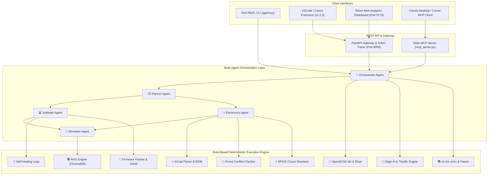

# 🤖 Autonomous Agent System — SOTA Multidisciplinary Engineering OS

[](https://github.com/Alihanesentas/agent_system)
[](https://www.python.org/)
[](LICENSE)
[](vscode_extension/)
[](mcp_server.py)

A State-of-the-Art **Neuro-Symbolic Autonomous Engineering & R&D Workstation** tailored for **Embedded Systems**, **Electronics PCB Design**, **Mechanical 3D CAD**, **Edge AI / TinyML**, and **Scientific Research**.

It seamlessly integrates an **Interactive Rich CLI**, a **FastAPI Token Tracer & React Web Analytics Dashboard**, a **VSCode & Cursor Sidebar Extension**, and a standard **Model Context Protocol (MCP) Server**.

---

## 📑 Table of Contents

- [✨ Key Features](#-key-features)
- [🏗️ System Architecture](#️-system-architecture)
- [📦 Complete Step-by-Step Installation Guide](#-complete-step-by-step-installation-guide)
  - [Step 1: Environment & Core Dependencies](#step-1-environment--core-dependencies)
  - [Step 2: Interactive REPL CLI Setup](#step-2-interactive-repl-cli-setup)
  - [Step 3: FastAPI Backend & React Web Dashboard Setup](#step-3-fastapi-backend--react-web-dashboard-setup)
  - [Step 4: VSCode & Cursor Extension Installation](#step-4-vscode--cursor-extension-installation)
  - [Step 5: Claude Desktop & Cursor MCP Server Setup](#step-5-claude-desktop--cursor-mcp-server-setup)
- [⚡ Complete Slash Command Reference (35+ Tools)](#-complete-slash-command-reference-35-tools)
- [🧩 Core Engineering Modules Deep-Dive](#-core-engineering-modules-deep-dive)
- [📁 Repository Directory Structure](#-repository-directory-structure)
- [🛠️ Troubleshooting & FAQ](#️-troubleshooting--faq)

---

## ✨ Key Features

- **🧠 Neuro-Symbolic Agent Architecture**: Combines neural LLM reasoning (OpenAI GPT-4o, Anthropic Claude 3.5 Sonnet, Google Gemini 1.5 Flash, Local Ollama Llama-3) with deterministic local Python engines for 0-token exact calculations and 100% mathematical accuracy.
- **🔌 KiCad PCB & Electronics Suite**: Parses `.kicad_sch` S-expressions, updates component values directly in schematic files, analyzes PCB Bill of Materials CSVs, and audits GPIO pin collisions & ESP32 strapping hazards.
- **📄 Datasheet PDF Extractor**: Extracts pin configuration tables, electrical characteristics, absolute maximum ratings, and key parameter specs from datasheet PDFs.
- **🔍 Real-Time Component API**: Integrates Mouser, DigiKey, and LCSC/Octopart APIs for parametric search, live stock status, volume pricing, and drop-in alternative component recommendations.
- **🔄 Autonomous Self-Healing Build Loop**: Compiles C/C++ source code. On compiler error (`stderr`), automatically captures tracebacks, feeds code to sub-agents, fixes syntax, and re-compiles until `return_code == 0`.
- **⚡ USB Firmware Flasher & Serial Monitor**: Flashes compiled binary files (`.bin`) to microcontrollers over USB/TTY (`esptool.py`, `st-flash`) and monitors live UART serial console logs.
- **📐 Mechanical CAD & 3D Slicer**: Generates 3D parametric OpenSCAD scripts for electronic enclosures and calculates FDM 3D printing slicer settings (PLA/ABS/PETG/TPU).
- **🧠 Edge AI & TinyML Engine**: Estimates peak Flash and SRAM (Tensor Arena) memory usage for INT8 quantized neural network models and generates ESP32-S3 ESP-DL C++ code headers.
- **📚 Ar-Ge & Patent Research**: Searches arXiv scientific preprints and generates WIPO/USPTO/Google Patents Boolean search queries and CPC classification codes.
- **🗳️ Multi-Model Consensus Voting**: Dispatches critical architectural prompts in parallel to OpenAI, Claude, and Gemini models, comparing answers and synthesizing a high-confidence consensus.
- **👤 Personalized Engineer Profile**: Stores user's personal hardware preferences (favorite MCU, CAD tool, baudrate, I2C pins) and injects personalized engineering rules across all sub-agent prompts.

---

## 🏗️ System Architecture



---

## 📦 Complete Step-by-Step Installation Guide

Follow these exact steps to set up the entire Agent System environment from scratch.

### Step 1: Environment & Core Dependencies

1. **Clone the Repository**:
   ```bash
   git clone https://github.com/Alihanesentas/agent_system.git
   cd agent_system
   ```

2. **Create and Activate Python 3.13 Virtual Environment**:
   ```bash
   python3 -m venv .venv
   source .venv/bin/activate
   ```

3. **Install Core Python Dependencies**:
   ```bash
   pip install --upgrade pip
   pip install -r requirements.txt
   ```
   *(Includes `fastapi`, `uvicorn`, `peewee`, `chromadb`, `pdfplumber`, `rich`, `requests`, `pyserial`, `esptool`)*.

4. **Set Up Environment Variables**:
   Copy `.env.example` to `.env` and fill in your API keys:
   ```bash
   cp .env.example .env
   ```
   Edit `.env`:
   ```env
   OPENAI_API_KEY=sk-...
   ANTHROPIC_API_KEY=sk-ant-...
   GEMINI_API_KEY=AIzaSy...
   NEXAR_API_KEY=...
   MOUSER_API_KEY=...
   GITHUB_TOKEN=ghp_...
   ```

---

### Step 2: Interactive REPL CLI Setup

Launch the Rich Visual Terminal REPL:
```bash
python agent.py
```

- **Verify Active Persona Badges**: You will see the active Agent badge (`[🧠 ORCHESTRATOR]`) and Model provider badge (`[OpenAI gpt-4o]`).
- **Run Help Command**: Type `/help` to see all 35+ available commands.
- **Toggle MCP Mode**: Type `/mcp-mode on` to route tasks via JSON-RPC Stdio, or `/mcp-mode off` for high-speed direct native execution.

---

### Step 3: FastAPI Backend & React Web Dashboard Setup

1. **Automatic Service Launch**:
   The CLI automatically ensures the backend FastAPI tracer is running on **Port 8000**.
   You can also launch it manually:
   ```bash
   uvicorn subagent_tracker.backend.main:app --host 127.0.0.1 --port 8000 --reload
   ```

2. **Launch React Web Analytics Dashboard**:
   In a new terminal window:
   ```bash
   cd subagent_tracker/frontend
   npm install
   npm run dev
   ```
   Open your browser at **`http://127.0.0.1:5173`** to view real-time token usage, latency graphs, model cost breakdowns, and benchmark session comparisons!

---

### Step 4: VSCode & Cursor Extension Installation

The repository includes a pre-packaged production extension: **`vscode_extension/agent-system-vscode-1.1.0.vsix`**.

1. **Install via CLI**:
   ```bash
   code --install-extension vscode_extension/agent-system-vscode-1.1.0.vsix --force
   ```
   *(Or for Cursor IDE: `cursor --install-extension vscode_extension/agent-system-vscode-1.1.0.vsix --force`)*.

2. **Install via VSCode GUI**:
   - Open VSCode.
   - Go to `Extensions` (`Cmd+Shift+X`).
   - Click the `...` menu in the top right corner -> `Install from VSIX...`.
   - Select `vscode_extension/agent-system-vscode-1.1.0.vsix`.

3. **Verify VSCode Sidebar & Settings**:
   - Open VSCode. You will see a new **`🤖 Agent System`** Robot icon on the left Activity Bar.
   - Click the icon to open the interactive **Webview Sidebar Panel**.
   - Highlight any code block and press **`Cmd+Alt+A`** (Mac) or **`Ctrl+Alt+A`** (Windows) to run agent tasks directly!

---

### Step 5: Claude Desktop & Cursor MCP Server Setup

To connect this entire multidisciplinary system into **Claude Desktop** as an official MCP Tool Server:

1. Edit your Claude Desktop configuration file:
   - **macOS**: `~/Library/Application Support/Claude/claude_desktop_config.json`
   - **Windows**: `%APPDATA%\Claude\claude_desktop_config.json`

2. Add the `agent-system` MCP server entry:
   ```json
   {
     "mcpServers": {
       "agent-system": {
         "command": "/Users/alihanesentas/Desktop/agent_system/.venv/bin/python3",
         "args": [
           "/Users/alihanesentas/Desktop/agent_system/mcp_server.py"
         ]
       }
     }
   }
   ```

3. Restart Claude Desktop. You will now see a hammer icon (`🔌`) listing all 7 multidisciplinary tools!

---

## ⚡ Complete Slash Command Reference (35+ Tools)

| Category | Slash Command | Arguments | Description & Usage Example |
| :--- | :--- | :--- | :--- |
| **Electronics & PCB** | `/kicad` | `<file.kicad_sch>` | Parse KiCad schematic components & net labels: `/kicad demo.kicad_sch` |
| | `/kicad-set` | `<file> <ref> <val>` | Update component value in schematic file: `/kicad-set demo.kicad_sch R1 1k` |
| | `/bom` | `<file.csv>` | Parse PCB Bill of Materials CSV line items: `/bom bom.csv` |
| | `/vision` | `<image_path>` | Encode schematic image to Base64 for Vision LLMs: `/vision schematic.png` |
| | `/datasheet` | `<pdf_path>` | Extract pin tables & electrical specs from PDF: `/datasheet ESP32.pdf` |
| | `/part` | `<part_number>` | Search Mouser/DigiKey for stock & pricing: `/part ESP32-WROOM-32E` |
| | `/alt` | `<part_number>` | Find in-stock & drop-in alternative components: `/alt AMS1117-3.3` |
| | `/compare` | `<p1> <p2>` | Side-by-side parametric component comparison: `/compare ESP32 STM32` |
| | `/pinout` | `<sda> <scl> <out>` | Audit GPIO pin conflicts & strapping hazards: `/pinout GPIO21 GPIO22 GPIO34` |
| | `/spice` | `<r_ohms> <c_farads>`| Simulate RC circuit frequency response: `/spice 1000 0.000001` |
| **Firmware & Production** | `/heal` | `<file.c>` | Autonomous self-healing build error recovery: `/heal main.c` |
| | `/flash` | `<file.bin>` | Flash binary to MCU via USB (`esptool`/`st-flash`): `/flash firmware.bin` |
| | `/serial` | `[port]` | Read live UART serial console logs: `/serial /dev/ttyUSB0` |
| | `/gerber` | `<folder>` | Analyze PCB Gerber layers & 3D enclosure bounds: `/gerber gerbers/` |
| | `/datasheet-compare`| `<p1.pdf> <p2.pdf>`| Comparative specification matrix for 2 PDF datasheets |
| **Mechanical CAD & R&D** | `/cad` | `<l> <w> <h>` | Generate OpenSCAD 3D parametric enclosure: `/cad 60 40 20` |
| | `/slicer` | `<material>` | Recommend 3D printing slicer settings: `/slicer PETG` |
| | `/arxiv` | `<query>` | Search arXiv scientific preprints for literature: `/arxiv ESP32 I2C` |
| | `/patent` | `<invention>` | Generate patent prior art search queries & CPC codes |
| **Edge AI & Personalization**| `/edge-ai` | `<params>` | Estimate TinyML SRAM/Flash memory footprint: `/edge-ai 150000` |
| | `/profile` | None | View personalized engineer profile preferences: `/profile` |
| | `/create-project` | `<name>` | Generate unified project repository workspace: `/create-project robot_sensor` |
| **Execution & Pipeline** | `/pipeline` | `<task>` | Run DAG workflow (Planner → [Hardware + Software] → Reviewer) |
| | `/consensus` | `<prompt>` | Run parallel consensus voting across OpenAI, Claude & Gemini |
| | `/run` | `<command>` | Execute shell build command: `/run gcc -Wall main.c -o main` |
| | `/git-commit` | `<message>` | Auto stage & commit all workspace changes: `/git-commit "Add I2C driver"` |
| | `/pr` | `<branch> <title>`| Create git branch, commit & submit GitHub Pull Request |
| | `/test` | None | Run automated agent unit test suite: `/test` |
| | `/mcp-mode` | `[on\|off]` | Toggle between Native Mode & MCP Stdio Protocol: `/mcp-mode on` |
| | `/mcp` | None | Display Model Context Protocol (MCP) server guide: `/mcp` |
| | `/tui` | None | Display interactive TUI system status dashboard: `/tui` |

---

## 🧩 Core Engineering Modules Deep-Dive

- **`core/schematics.py`**: KiCad S-expression parser supporting component extraction (`R1`, `C1`, `U1`), pin references, net labels, and safe regex value updating.
- **`core/datasheet.py`**: Multi-page PDF parser utilizing `pdfplumber` to extract pin tables, electrical characteristics, absolute maximum ratings, and section headers into clean JSON summaries.
- **`core/component_search.py`**: Unified parametric component search querying Mouser API v2, Nexar/Octopart GraphQL API, and fallback local catalogs for real-time stock, pricing, and drop-in alternatives.
- **`core/self_heal.py`**: Closed-loop compiler repair engine. Captures `stderr` build errors from `gcc`/`make`/`platformio`, feeds code + error trace to the Reviewer Sub-Agent, patches code, and re-compiles until successful.
- **`core/flasher.py`**: Hardware flasher integrating `esptool.py` and `st-flash` to write firmware binaries to physical MCUs and monitor live UART serial logs via `pyserial`.
- **`core/mechanical.py`**: 3D CAD parametric script engine generating OpenSCAD enclosure geometry and computing FDM slicer print parameters (nozzle temp, bed temp, infill density).
- **`core/edge_ai.py`**: TinyML model inspector calculating peak Flash and SRAM (Tensor Arena) memory budgets for INT8 quantized neural networks and outputting ESP-DL / TFLite Micro C++ wrappers.
- **`core/profile.py`**: Personalized engineer profile manager (`user_profile.json`) storing user preferences and injecting custom engineering constraints into sub-agent prompts.

---

## 📁 Repository Directory Structure

```
agent_system/
├── agent.py                       # Main REPL CLI with Rich UI, Badges & Slash Commands
├── mcp_server.py                  # Standard MCP Stdio JSON-RPC 2.0 Server
├── user_profile.json              # Personalized Engineer Profile Settings
├── core/
│   ├── agent_test.py              # Agent Unit Testing & Quality Assurance
│   ├── cache.py                   # Semantic Cache Engine (%80 Token Savings)
│   ├── cli_ui.py                  # Rich Terminal Engine (Badges, Thinking Box, TUI)
│   ├── component_search.py        # Mouser/DigiKey/LCSC Component API Integration
│   ├── consensus.py              # Multi-Model Consensus Voting (OpenAI+Claude+Gemini)
│   ├── datasheet.py              # Datasheet PDF Extractor (Pin Tables, Electrical Specs)
│   ├── datasheet_compare.py      # Comparative Datasheet Specification Matrix
│   ├── edge_ai.py                 # TinyML Peak Memory Estimator & ESP-DL C++ Wrapper
│   ├── executor.py               # Tool Executor (gcc, g++, make, platformio)
│   ├── flasher.py                # USB Firmware Flasher (esptool/st-flash) & Serial Monitor
│   ├── git_ops.py                # Automated Git Version Control
│   ├── github_pr.py              # GitHub Branch & Pull Request Automation
│   ├── llm.py                    # Multi-Provider Router (OpenAI, Anthropic, Gemini, Ollama)
│   ├── longmem.py                # SQLite Persistent Long-Term Memory
│   ├── mechanical.py             # OpenSCAD 3D Parametric CAD & Slicer Recommendations
│   ├── mcp_client.py             # MCP Execution Mode Switcher (/mcp-mode)
│   ├── notify.py                 # Webhook System (Slack, Discord, Telegram)
│   ├── pinout.py                 # Pinout Conflict Checker (ESP32/STM32/RP2040)
│   ├── pipeline.py               # Multi-Agent DAG Orchestration Engine
│   ├── plugins.py                # Dynamic Plugin Architecture
│   ├── profile.py                # Personalized Engineer Profile Manager
│   ├── project_gen.py            # Multidisciplinary Project Repository Generator
│   ├── rag.py                    # RAG Vector Store Engine (ChromaDB + pdfplumber)
│   ├── research.py               # arXiv Academic Search & Patent Prior Art Generator
│   ├── runner.py                 # Sub-Agent Prompt Router & Context Loader
│   ├── schematics.py             # KiCad S-Expression Parser & CSV BOM Analyzer
│   ├── self_heal.py              # Autonomous Self-Healing Compilation Repair Loop
│   ├── self_improve.py           # Auto-Refine Agent Prompt Specs
│   ├── service.py                # Daemon Service Manager (FastAPI + Vite)
│   ├── spice.py                  # SPICE RC/RLC Circuit Simulator Engine
│   ├── tui_dashboard.py          # Interactive Terminal TUI Dashboard Component
│   └── vision.py                 # Base64 Image Encoder for Vision LLMs
├── agents/                       # Sub-Agent Prompt Specifications
│   ├── electronics.md
│   ├── orchestrator.md
│   ├── planner.md
│   ├── reviewer.md
│   ├── software.md
│   └── tutor.md
├── vscode_extension/             # VSCode & Cursor Extension (v1.1.0)
│   ├── package.json              # Extension Manifest & Keybindings (Cmd+Alt+A)
│   ├── src/extension.ts          # Extension Entrypoint & Webview Sidebar Provider
│   └── agent-system-vscode-1.1.0.vsix # Compiled Production VSIX Package
└── subagent_tracker/            # Real-Time Token & Cost Tracer
    ├── backend/main.py           # FastAPI Backend & REST API Gateway
    └── frontend/                 # React Web Analytics Dashboard
```

---

## 🛠️ Troubleshooting & FAQ

#### Q: How do I run the system completely offline without paying for cloud LLMs?
**A**: Install [Ollama](https://ollama.ai/) locally and pull Llama 3 (`ollama run llama3`). Then inside `agent.py`, switch model provider: `/model llama3`.

#### Q: Why does `/mcp-mode on` use slightly more tokens?
**A**: Standard MCP protocol requires sending JSON schemas for all registered tools in every request. Use `/mcp-mode off` for direct native execution with zero schema token overhead.

#### Q: How do I add my custom engineering rules?
**A**: Edit `user_profile.json` or use `/profile` command. Your custom rules will be automatically injected into all sub-agent prompts.

---

## 📄 License

Distributed under the **MIT License**. See `LICENSE` for details.
